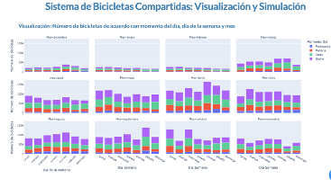
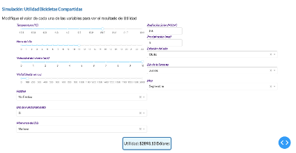
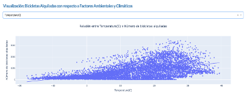

# Proyecto1-A
En el contexto de los servicios de bicicletas compartidas, asegurar la sostenibilidad financiera del sistema es crucial para su éxito a largo plazo. La optimización de los ingresos y la gestión eficiente de los costos son aspectos fundamentales para mantener la operatividad y cumplir con las expectativas de rentabilidad. Sistema de Bicicletas Compartidas: Visualización y Simulación posee dos enfoques de visualización uno enfocado hacía el comportamiento del número de bicicletas alquiladas de acuerdo con momento del día, día de la semana y mes. Por otra parte, se presenta un diagrama de dispersión mediante un menú desplegable que permite la visualización de cada una de las variables explicativas del modelo conforme con factores climáticos y ambientales. 

# Funcionalidades
1.	Permite la visualización del número de bicicletas rentadas frente a variables temporales y estacionales.
2.	Representación en tiempo real de variables que afectan el sistema de bicicletas compartidas frente a un valor de Utilidad Total.
3.	Modelos de Predicción para definir la utilidad esperada del sistema de bicicletas compartidas.
4.	Análisis comparativo del número de bicicletas rentadas frente a factores climáticos y ambientales.

# Autores
Gabriela Correa- mg.correa@uniandes.edu.co 
Camila Luna- m.lunav@uniandes.edu.co 
Laura Hurtado- l.hurtadou@uniandes.edu.co
